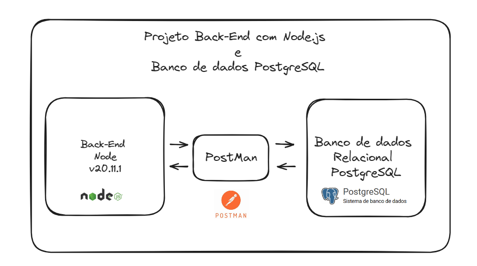

# Projeto de Desenvolvimento de API

Este projeto consiste no desenvolvimento de uma API para gerenciar clientes em um banco de dados PostgreSQL, utilizando Node.js e Express.

## Arquitetura



## Instalação

1. Clone este repositório para o seu ambiente local.
2. Certifique-se de ter o Node.js e o PostgreSQL instalados em sua máquina.
	2.1 Na pasta DB temos os scripts para criar os objetos no banco de dados PostgreSQL.
	
3. Instale as dependências do projeto usando o seguinte comando:
    ```
	npm install express                     /*Framework de aplicativo da web NODE */
	npm install dotenv  				    /*Biblioteca para variáveis de ambiente */
	npm install pg                          /*Biblioteca PostgreSQL*/
	npm install cpf-cnpj-validator date-fns /*Bibliotecas para validação cpf-cnpj*/
	npm install date-fns                     /*Bibliotecas para validação de Datas*/
    ```
4. Configure as variáveis de ambiente no arquivo `.env` conforme necessário.

## Uso

1. Inicie o servidor da API usando o seguinte comando:
    ```
    npm start
    ```
2. Acesse a API através do endpoint especificado no arquivo de rotas.

## Funcionalidades

- **GET /clientes**: Retorna todos os clientes cadastrados.
- **GET /clientes/:id**: Retorna um cliente específico com base no ID.
- **GET /clientes?_ID_Cliente=...&_ID_ClienteTipo=...&_nrCpfCnpj=...&_nm_Cliente=...&_ID_Registro=...**: Retorna clientes com base nos parâmetros fornecidos. Você pode fornecer um ou mais parâmetros para filtrar os resultados.
- **POST /clientes**: Adiciona um novo cliente ao banco de dados.
- **PATCH /clientes/:ID_Registro**: Atualiza os dados de um cliente existente no banco de dados.
- **DELETE /clientes/:ID_Registro**: Remove um cliente do banco de dados.

## Tecnologias Utilizadas

- Node.js
- Express.js
- PostgreSQL
- Sequelize (ORM)
- Jest (para testes)

## Testando a API com o Postman

Você pode testar os endpoints da API usando o Postman. Aqui estão os passos para testar cada funcionalidade:

1. **GET /clientes**: Envie uma solicitação GET para este endpoint para obter uma lista de todos os clientes cadastrados.

2. **GET /clientes/:id**: Envie uma solicitação GET para `/clientes/:id`, onde `:id` é o ID do cliente que você deseja recuperar.

3. **GET /clientes?_ID_Cliente=...&_ID_ClienteTipo=...&_nrCpfCnpj=...&_nm_Cliente=...&_ID_Registro=...**: Envie uma solicitação GET para `/clientes` com os parâmetros desejados para filtrar os resultados.

4. **POST /clientes**: Envie uma solicitação POST para `/clientes` com os dados do novo cliente no corpo da solicitação. Certifique-se de incluir os campos `nm_cliente`, `nrCpfCnpj`, `email` e `DtNascimento`.

5. **PATCH /clientes/:ID_Registro**: Envie uma solicitação PATCH para `/clientes/:ID_Registro`, onde `:ID_Registro` é o ID do cliente que você deseja atualizar. Inclua os campos que deseja atualizar no corpo da solicitação.

6. **DELETE /clientes/:ID_Registro**: Envie uma solicitação DELETE para `/clientes/:ID_Registro`, onde `:ID_Registro` é o ID do cliente que você deseja excluir.

## Validação de CPF/CNPJ e Data

A API inclui validações para garantir que os campos CPF/CNPJ e Data estejam formatados corretamente antes de serem inseridos no banco de dados.

- **CPF/CNPJ**: A API verifica se o CPF/CNPJ fornecido é um número válido e se está no formato correto antes de inseri-lo no banco de dados.

- **Data de Nascimento**: A API valida se a data de nascimento fornecida está em um formato válido (DD/MM/AAAA) antes de inseri-la no banco de dados.

## Contribuição

Contribuições são bem-vindas! Se você encontrar algum problema ou quiser contribuir com novos recursos, sinta-se à vontade para abrir uma issue ou enviar uma pull request.

## Licença

Este projeto está licenciado sob a Licença MIT. Consulte o arquivo LICENSE para obter mais detalhes.
